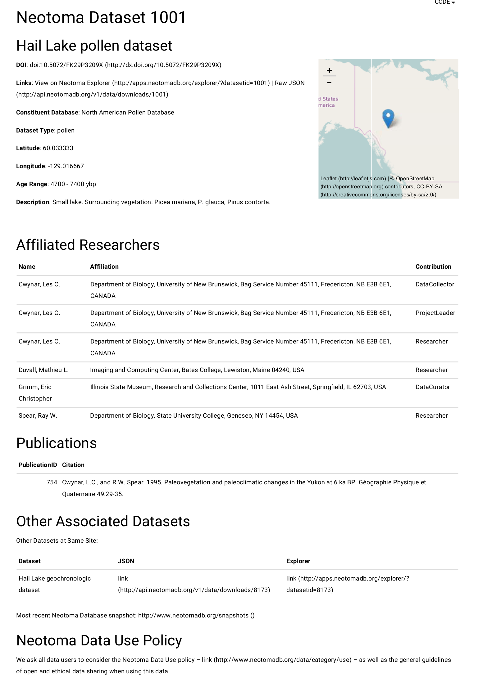

```{r, echo=FALSE, message = FALSE, warnings=FALSE, tidy=TRUE}
runner = FALSE

library(RODBC, quietly = TRUE, verbose = FALSE)
library(httr, quietly = TRUE, verbose = FALSE)
library(XML, quietly = TRUE, verbose = FALSE)

source('builder/R/sql_calls.R')

schema <- xmlSchemaParse('data/metadata.xsd')
sens <- read.table('doi_sens.txt', stringsAsFactors = FALSE)

con <- odbcDriverConnect('driver={SQL Server};server=SIMONGORING-PC\\SQLEXPRESS;database=Neotoma;trusted_connection=true')

```

**120 Character Summary**

*Using \@neotomadb as a case study for improving data discoverability through DOIs.*

\pagebreak

#Title

Implementing the Digital Object Identifier system within the Neotoma Paleoecological Database

#Abstract

The Neotoma Paleoecological Database contains over 12000 unique datasets, representing the combined work of thousands of researchers.  In an effort to improve recognition and discoverability of the intellectual contributions of contributing researchers, Neotoma implemented Digital Object Identifier names for records within the database.  Using the DataCite DOI system and the EZID API, this paper details the methods used and simple case studies to indicate the possibilities now available to both contributing researchers and to individuals interested in exploring the connections made possible through the implementation of DOI names within Neotoma.

\pagebreak

**Key Words**: metadata, discoverability, dois, data publication, digital curation

#Introduction

Digital object identifier (DOI) names for data provide a critical resource that ties the intellectual contribution of an individual or team of individuals to derived products beyond the life cycle of the publication.  Discoverability of data relies on clear, standardized and fully described metadata, which allow for greater discoverability through progressively more powerful semantic search technologies [@leinfelder2011using].  Greater data discoverability ensures that the rewards for parcticing science in an open and transparent manner are fully realized [@reichman2011challenges;@piwowar2007sharing].

DOI names have been minted for data since 2004 [@brase2015tenth]. While the minting of DOI names are strongly associated with publication, in the case of data, the publication model may be inappropriate [@parsons2013data], and as such a new model was neccessary.  The Neotoma Paleoecological Database approximates the publication metaphor by providing two value-added services following data contribution.  Neotoma maintains a strong central data structure, defined through collaboration with end-user groups, providing data that adheres to community standards, facilitating data re-use and sustainability [@gallagher2015facilitating].

A key component of long term data-sustainability is the use of domain specific data repositories [@goodman2014ten]. The Neotoma Paleoecological Database is a key domain repository within the biogeosciences, focusing on botanical and faunal fossil data across the Neogene.  The core of the Neotoma Paleoecological Database rests on two fundamental data contributions.  The first, COHMAP [@anderson1988climatic], was the result of an international, interdisciplinary effort that resulted in the contribution of 241 datasets across 207 publications from 333 allied researchers.  This research contribution led to one of the first model-data intercomparison projects, with a lasting legacy for paleoclimate and climate modeling [@wright1993reflections]. The second large data contribution was the result of the FAUNMAP project, centered on assembling fossil records from the United States spanning the Pleistocene.  FAUNMAP was the result of contributions representing 3202 researchers, across 2005 unique publications, resulting in fundamental contributions to our understanding of species responses to climate change over long time scales [@graham1996spatial].  In both cases the call for open and unrestricted data sharing was less stringent than it is currently, with fewer enforcement or regulatory elements, but the success of these efforts reflects the enormous value of open data.

Currently, Neotoma contains 12962 datasets (as of October, 2015).  There are 20 unique data types, and these data products represent the cummulative work of 6522 individuals or organizations.  Access to Neotoma is made primarily through three platforms.  The database itself is a SQL Server 2012 database that is available as snapshots from the Neotoma website -- [http://neotomadb.org]() -- while data search capacity is supported through a map-based web engine (Neotoma explorer) or through the API and associated R package `neotoma` [@goring2015neotoma].  The datasbase itself is described more fully elsewhere [@neotomamanual].

Here we describe the efforts to facilitate the minting and provisioning of DOI names for the Neotoma Database through DataCite/EZID, the steps we have taken to ensure increased discoverability of data, the steps to support ongoing versioning of datasets, and, ultimately, the possibilities that DOIs provide both to Neotoma, to facilitate ongoing database development and evolution, and also to individuals who provide data to Neotoma as part of their data management planning.

#Background

In 2016, Neotoma, through the University of Wisconsin Library System obtained authorization to mint DOI names for data contained within the database.  The DOI system originated through a collaboration among three large publishing associations in 1997 [@doihandbook], and, although it was primarily focused on minting unique identifiers for published materials, the vision of DOI names for data came soon afterwards [@paskin2005digital].  While DOI names do not resolve to the data categorically, they provide metadata (supplied in the process of minting a DOI) and a resolution service that facilitates the long term discoverability and sustainability of data generated by researchers.  A review of available object identifiers found that DOIs provide strong support for DOIs, although a clear choice for identifiers remained purpose-specific [@duerr2011utility].

In the case of Neotoma the use of DOI names for individual datasets facilitates serveral key objectives:

  1.  DOI names allow Neotoma to act as a repository for journals following JDAP policy, where proof of data archiving often requires the provisioning of a DOI name.  This provides additional incentives to researchers contributing data to Neotoma as part of a sustainable Data Management plan [e.g., @michener2015ten;@hsu2015data].

  2.  DOI names connect Neotoma data to a broader set of services, in this case facilitated through the EZID and DataCite metadata search engines.  These names help connect datasets to publications through additional DOI system metadata, and to unique researchers through services such as ORCID.  This provides added value to researchers contributing data to Neotoma as it allows a full and open accounting of research contributions, particularly valuable for early career researchers or researchers involved in interdisciplinary research [@goring2014improving].

  3.  A DOI provides a unique and persistent identifer to datasets and their associated metadata that can be resolved from any browser connected to the internet, whether or not the user has knowledge of Neotoma and its specific database location, schema or API.

# Use Case

This document lays out the outline for establishing DOIs for the database using the EZID API and the DataCite metadata schema -- [pdf here](http://schema.datacite.org/meta/kernel-3/doc/DataCite-MetadataKernel_v3.1.pdf) as the basis of our the process.  We have consulted a number of resources describing best practices in scholarly data citation and data provision [@starr2015achieving; @hourcle2012linking], and have made a significant effort to provide the most accurate and complete metadata record for Neotoma data possible.

Given the database structure [@neotomamanual; http://neotoma-manual.readthedocs.io/en/latest/], there is no single database table that maps directly to the DataCite schema. There is a data construct within the existing Neotoma API `downloads` structure (*e.g.*, [http://api.neotomadb.org/v1/data/downloads/14196]()) that mirrors (to some degree) the concept of a complete dataset.  The `download` object will be the atomic unit for DOI assignment and, perhaps confusingly, will be refered to as a "dataset" in this document, although a second API service exists that refers to "datasets" [@goring2015neotoma]. The API "dataset" service excludes count or sample data for a site, and as such doesn't serve the needs for the assignment of DOI names since it does not enable complete data archiving.

Neotoma, in establishing a DOI service, had two main use cases.  (1) Pre-existing records, and records that will provided to Neotoma as a set of datasets (either the inclusion of a new Constituent Database, or as the result of a data synthesis project) will require bulk assignment records. (2) New records are uploaded individually through Tilia ([http://tiliait.com]()) or a data upload web service (in development). For each of these two use cases the process is generally the same for the actual call to DataCite/EZID.

In each case the process for minting DOIs and providing suitable, searchable metadata is as follows:

  * Discover data with an empty dataset DOI field
  * The script generates an XML document that conforms to the DataCite 3.1 XML Schema
  * On success, the script calls out to DataCite/EZID & generates a DOI and assigns metadata
  * On success, a landing page is created programmatically
  * The DOI is attached to the `Datasets` table
  * An email is sent to the Dataset PI with the dataset DOI & metadata, and to the relevant Data Steward

This system is implemented in R [@Rcitation] for the purposes of educational outreach, and the ability to implement this framework and paper using `Rmarkdown` [@rmarkdown], providing an open and reproducible research product. R is widely used within the academic research community, with a long history in the geosciences [@grunsky2002r]. Additionally, R provides functions for working with SQL [@RMySQL], XML [@rxml] and CURL [@httr].

Initialization for the processing of records is fairly straightforward.  The script for the SQL commands is available in the supplemental material (Supplement One, or as a  [gist](https://gist.github.com/SimonGoring/defa8bcfd2216f80913afebfa29a901a) for GitHub), although it is called directly from this document.

# Implementation

#The Landing Page

![site_page_output.png]
<div style="float: right; width: 300px; margin: 0 0 15px 20px; padding: 15px; border: 1px solid black; text-align: left;">

<br><b>Figure 1</b>. A sample landing page for a Neotoma record.
</div>

The landing page for each record provides an important resource.  The pages were written as RMarkdown documents [link]() that could be run serially or individually as part of the workflow for assigning DOIs to records. Hourclé &al [@hourcle2012linking] indicate that best practice is to resolve documents to both HTML (human-readable) and machine readable formats through content negotiation systems.  DataCite resolves `text/html` content to the unique identifier provided by the data service (Neotoma), wheras other machine readable formats are resolved to DataCite's own metadata service [http://crosscite.org/cn/]().

The landing page provides an endpoint for citations, with relevant metadata.  It provides an aesthetically clean display with an interactive map element supported through `leaflet` [@cheng2016leaflet].  The DOI resolves directly to the landing page, and the landing page will be updated (along with versioning) if the underlying content changes.  In addition, the landing page includes 'microdata', embedded using a Resource Description Framework model for the paleoecological, spatial and temporal data contained within the record.  This provides greater functionality for the entire DOI system implemented within Neotoma.

One limitation for the current procedure is that extended descriptors or methods for the datasets are unavailable through Neotoma within the current database data model.  While individual authors may provide methods, this information is often not stored in Neotoma itself, although certain aspects of the methods may be.  This limitation of the current database structure means that methodological information may be lacking.  However, content delivered through the Tilia XML is more complete and may provide greater information.

#Building the XML Document:

As mentioned in the Introduction, there is no single object in Neotoma that represents all the metadata associated with a dataset.  The dataset, in the sense of a citable unit, is a synthetic construct pulled from `Site`, `Dataset`, `CollectionUnit` and `Sample` information, although a `dataset` table does exist in Neotoma, that helps link these components together [@neotomamanual].  To fill in the metadata fields we need to generate several SQL queries to the database.  Here we will use a dataset ID of `1001`, a record for Hail Lake, YT, Canada, generated by Les Cwynar.  [Explorer link](http://apps.neotomadb.org/explorer/?datasetid=1001), [JSON download](http://api.neotomadb.org/v1/data/downloads/1001).

To first generate the XML document, we use namespace definitions and the schema provided by DataCite as v3.1 [@]

```{r, results='hide', tidy = TRUE, eval=TRUE}
# Building the XML document:

ds_id <- 1001

# Generating the new XML framework and associated namespaces:
doc <- newXMLDoc()

root <- newXMLNode('resource', 
                   namespaceDefinitions = c("http://datacite.org/schema/kernel-3",
                             "xsi" = "http://www.w3.org/2001/XMLSchema-instance"),
                   attrs = c("xsi:schemaLocation" = "http://datacite.org/schema/kernel-3 http://schema.datacite.org/meta/kernel-3/metadata.xsd"), 
                   doc = doc)

```

#Assigning Metadata Tags

We structure this paper in the same order as the [DataCite Schema Documentation](https://schema.datacite.org/meta/kernel-3/doc/DataCite-MetadataKernel_v3.1.pdf). SQL queries to Neotoma have been wrapped within R functions that use dataset number (`1001` here) as the key parameter (Supplement One).

##Identifier

The `identifier` links directly to the dataset's Landing Page.  The generation of the landing page is covered elsewhere.

```{r, results = 'hide', message = FALSE, warning = FALSE, eval=TRUE}
default <- sqlQuery(con, query = default_call(ds_id))

# Clean the affiliation:
default$affiliation <- gsub('\r\n', ', ', default$affiliation)

# This is the empty shoulder for assigning DOIs:
newXMLNode("identifier", '10.5072/FK2', 
           attrs = c('identifierType' = 'DOI'), parent = root)

```

##Creators:

While affiliated researchers occur futher in the list, we use the `datasetpi` field from the Neotoma Database to assign the Creator field.  While the majority of datasets have only a single assigned PI, there are `r sum(table(sqlQuery(con, query = "SELECT DatasetID FROM datasetpis"))>1)` datasets with multiple creators.  The Dataset PI is the individual (or individuals) who are cited in the data citation.

```{r, results = 'hide', message = FALSE, warning = FALSE, eval=runner}
newXMLNode("creators", parent = root)

lapply(1:nrow(default),
       function(x) {
         addChildren(root[["creators"]], newXMLNode("creator",
                    .children = list(newXMLNode("creatorName",
                                                default$creatorName[x]),
                                     newXMLNode("affiliation",
                                                default$affiliation[x]))))
        })

```

##Titles

The title is a synthetic object, produced by combining the site name and the data type.  In this case, we generate the name `r default$SiteName[1]`.

```{r, results = 'hide', message = FALSE, warning = FALSE, eval=runner}
newXMLNode("titles", parent = root)
newXMLNode("title", 
           default$SiteName[1],
           attrs = c("xml:lang" = "en-us"),
           parent = root[["titles"]])

```

##Publisher & Publication Year

Neotoma consists of two levels of publication.  The model for data publication in Neotoma is published volumes within a book, where each constituent database is a "chapter" with a unique editor, published as part of the Neotoma Paleoecological Database.  Because Neotoma acts as a portal for many unique databases it is important to recognize both the primacy of the original database, but also the effort taken by the managers of those databases in assembling data and building community around those data products.  However, for `Publication`, we consider the creation of the DOI the moment of publication and Neotoma, as the licensing agent, the publisher. There is an opportunity to describe dates with more granularity in the metadata schema below.

```{r, results = 'hide', message = FALSE, warning = FALSE, eval=runner}
newXMLNode("publisher", "Neotoma Paleoecological Database", parent = root)

# Number 5:
newXMLNode("publicationYear", format(Sys.Date(), "%Y"), parent = root)
```

##Subject

The Subject and Subject Scheme information is critical for metadata discovery, but while DataCite requests the use of existing subject schemes, some research in the library sciences cautions against the use of formal subject schemes, given that modern web searching has not formally adopted the structured schemes used in library classification schemes.  

<-- I've created a document [here](https://docs.google.com/document/d/1wcR6WWAV3COD_MeOgaOEqtpJ3bbe1nxF9omnmmlEA5Q/edit?usp=sharing) that discusses it in more detail..  For now I will assign everything "Paleoecology". -->

```{r, results = 'hide', message = FALSE, warning = FALSE, eval=runner}

newXMLNode("subjects", newXMLNode("subject", 
                                  "Paleoecology",
                                  attrs = c("subjectScheme" = "Library of Congress",
                                            "schemeURI" = "http://id.loc.gov/authorities/subjects")), 
           parent = root)

```

##Contributors

The contributor information comes from the `Contact` tables for the record.  There is a query (in `sql_calls.R`) that pulls in contributor information.  Right now we are not tagging the name identifiers (e.g., ORCID). Historically Neotoma has not had the ability to add or store identifier systems such as ORCID ([http://orcid.org]()), however this functionality has recently been introduced, although more work is required to fully implement the system.

Contributors to the dataset include individuals beyond the dataset PI (above).  When a dataset is entered into Neotoma there may be a number of individuals who interact with the data, including data entry technicians, individuals who may update the age model, individuals who assisted in field collection, etc.  Neotoma strongly believes in transparency, and credit for data contribution, however, we believe that this is balanced by clear attribution for data generation.  As such, the *Contributors* fields in the metadata lists all individuals associated with the dataset, but the data citation lists only the dataset PI.

```{r results='as-is', echo=FALSE, eval=runner}
contacts <- sqlQuery(con, query = contributor_call(ds_id))

contacts$affiliation <- gsub('\r\n', ', ', contacts$affiliation)
knitr::kable(contacts)
```

```{r, results='hide', eval=runner}

# The contributors come from the DB call.  This duplicates 
newXMLNode("contributors", parent = root)
lapply(1:nrow(contacts), 
       function(x) { 
         newXMLNode("contributor", 
                    attrs = c("contributorType" = contacts$contributorType[x]),
                    .children = list(newXMLNode("contributorName", 
                                                contacts$creatorName[x])), parent = root[["contributors"]])
         })
```

##Dates

Dates in Neotoma include datas of original accession to the North American Pollen Database (or other constituent database), accession into Neotoma, and subsequent revision dates.

```{r results='as-is', echo = FALSE, eval=TRUE}
dates   <- sqlQuery(con, query = date_call(ds_id))
knitr::kable(dates)
```

```{r, results='hide'}
# Adding the dates in one at a time, we use the lapply to insert them
# into the `dates` node.
newXMLNode("dates", parent = root)
lapply(1:nrow(dates), 
       function(x) { 
         newXMLNode("date", 
                    format(as.Date(dates[1,1]), "%Y-%m-%d"), 
                           attrs = c("dateType" = dates[x,2]), 
                    parent = root[["dates"]]) 
         } )

```

##Language and Resource Type

```{r, echo = TRUE, results='hide', eval=runner}
# Number 9:
newXMLNode("language", "English", parent = root)

# Number 10:
newXMLNode("resourceType", "Dataset/Paleoecological Sample Data", 
           attrs = c("resourceTypeGeneral" = "Dataset"), parent = root)

```

##Related Identifiers

`RelatedIdentifiers` are key metadata for the data records.  These identifiers will point to the URL of the publications relating to the dataset using `isCitedBy` (as opposed to `IsReferencedBy`), they will point to the DOI for Neotoma using `???`, and will use `????` for duplicate copies of data when the records are stored across databases.  The Related Identifiers are critical pieces of cyberinfrastructure, explicitly linking the data to other resources through the DOI infrastructure.

```{r, results = 'hide', message = FALSE, warning = FALSE, eval=runner}

newXMLNode("relatedIdentifiers", parent = root)

newXMLNode("relatedIdentifier", paste0("api.neotomadb.org/v1/downloads/", ds_id),
  attrs = list(relationType = "IsVariantFormOf",
               relatedIdentifierType = "URL",
               relatedMetadataScheme = "json"),
  parent = root[["relatedIdentifiers"]])

newXMLNode("relatedIdentifier", "http://doi.org/10.17616/R3PD38",
  attrs = list(relationType = "IsCompiledBy",
               relatedIdentifierType = "DOI"),
  parent = root[["relatedIdentifiers"]])

# Publication DOI tags (if available)
dois <- sqlQuery(con, query = doi_call(ds_id))

if (is.na(dois)) {
  # There's no current DOI
} else {
  lapply(unlist(dois), function(x){
    newXMLNode("relatedIdentifier", paste0("doi:", x),
  attrs = list(relationType = "IsDocumentedBy",
               relatedIdentifierType = "DOI"),
  parent = root[["relatedIdentifiers"]])
  })
}

```

##Size

Data object size can be reported for each component of the data source, JSON, XML, TLX or others.  This term is straightforward and needs little explanation.

```{r, results='hide', eval=runner}
# Number 13: size
size <- as.numeric(object.size(GET(paste0("api.neotomadb.org/v1/downloads/", ds_id))))

newXMLNode("sizes", newXMLNode("size", paste0('JSON: ', ceiling(size/1000), " KB")), parent = root)

```

##Format

The data, as indicated above, is available through the landing page in only two formats, JSON or TLX.  Future formats (including JSON-LD) will be supported, and, at this point the metadata will be updated.

```{r, results = 'hide', message = FALSE, warning = FALSE, eval=runner}
# Number 14:
newXMLNode("formats", parent = root)
newXMLNode("format", "XML", parent = root[["formats"]])
newXMLNode("format", "TLX", parent = root[["formats"]])
newXMLNode("format", "JSON", parent = root[["formats"]])
```

##Version

Version is defined for all datasets as v1.0, from the date of initial generation of the DOI.  Following this, we have developed a script that is triggered when a dataset is modified, indicating the modification date and an incremented version number.  One reccomendation for data that may change over time, is to cite an authoratative dataset (with DOI), but to include access date and time to the citation.  Netoma will recommend this practice going forward.

##Rights List

The Neotoma Database provides a User Agreement for the database and constituent datasets.  Ultimately, the goal of the database is to provide open exchange of data to researchers and the public.  In 2015 the a decision was made to license Neotoma data under a Creative Commons BY4 License -- [http://creativecommons.org/licenses/by/4.0/deed.en_US](). Under this license there is a requirement for appropriate credit, in a reasonable manner, however the license provides broad protenction to the licensee for modification and downstream use of the dataset.

```{r, results='hide', eval=runner}
# Number 16

addChildren(newXMLNode("rightsList", parent = root),
           children = newXMLNode("rights", "CC-BY4", 
           attrs = c("rightsURI" = "http://creativecommons.org/licenses/by/4.0/deed.en_US")))

```

##Description

`Description` and `DescriptionType`, not sure what to put here.  It's supposed to be technical information & best practice to supply a Description.  Do we use site description, something else?

##GeoLocation

I use the full four coordinate string here.  People can figure out if it's a polygon or not.

```{r, results = 'hide', message = FALSE, warning = FALSE, eval=runner}
loc <- sqlQuery(con, query = geoloc_call(1001))

newXMLNode("geoLocations", parent = root)
newXMLNode("geoLocation", 
           newXMLNode("geoLocationBox", loc, parent = root),
           parent = root[["geoLocations"]])

```

##Validation and Upload

```{r, message = FALSE, warning = FALSE, eval=runner}
xmlSchemaValidate('data/metadata.xsd', doc)
```

The schema now validates properly, we're happy about that, and so we push it using the EZID API:

```{r, results = 'hide', message = FALSE, warning = FALSE, eval=runner}

urlbase = 'https://ezid.cdlib.org/'

# We need to clean up the XML formatting, removing hard returns and changing quotes:
parse_doc <- gsub('\\n', '', paste0('datacite: ',
                         saveXML(xmlParse(paste0('data/datasets/', 
                                                 ds_id, '_output.xml')))))
parse_doc <- gsub('\\"', "'", parse_doc)

r = POST(url = paste0(urlbase, 'shoulder/doi:10.5072/FK2'), 
	       authenticate(user = 'apitest', password = 'apitest'),
         add_headers(c('Content-Type' = 'text/plain; charset=UTF-8',
                       'Accept' = 'text/plain')),
	       body = parse_doc,
	                   format = 'xml')

out_doi <- substr(content(r), 
                  regexpr("doi:", content(r)), 
                  regexpr("\\s\\|", content(r)) - 1)

# Now that we've got an assigned DOI, push it into the XML:
```

```{r results = 'hide', message = FALSE, warning = FALSE}

if (!runner) {
  out_doi <- 1001
}

```

This then gives us a DOI `r out_doi` that we can check.  In the current implementation we'll need to update the record with the new identifier, but once we get our own shoulder we'll be fine and won't have to update `identifier` after data upload.

#Updating Records

In cases where a data set is updated, Neotoma still directly modifies the record.  This will (or may) change.  Now that we can build the XML okay we should be able to modify the DOI metadata using:

```{r, results = 'hide', message = FALSE, warning = FALSE, eval=runner}

xmlValue(root[["identifier"]]) <- out_doi

saveXML(doc = doc, 
        file = paste0('data/datasets/', ds_id, '_output.xml'),
        prefix = '<?xml version="1.0" encoding="UTF-8"?>')
```
```
r = POST(url = paste0(urlbase, paste0('identifier/', out_doi)), 
	       authenticate(user = 'apitest', password = 'apitest'),
         add_headers(c('Content-Type' = 'text/plain; charset=UTF-8',
                       'Accept' = 'text/plain')),
	       body = paste0('datacite: ',paste(readLines(paste0('data/datasets/', 
                ds_id,  '_output.xml')), collapse = " ")),
	                   format = 'xml')
content(r)
```

This is what DataCite has to say about Dynamic data:

**For datasets that are continuously and rapidly updated, there are special challenges both in citation and preservation. For citation, three approaches are possible:**
  
  *1. Cite a specific slice (the set of updates to the dataset made during a particular period of time or to a particular area of the dataset);*
  
  *2. Cite a specific snap shot (a copy of the entire dataset made at a specific time);*
  
  *3. Cite the continuously updated dataset, but add an Access Date and Time to the citation.*
  
**Note that a “slice” and “snap shot” are versions of the dataset and require unique identifiers. The third option is controversial, because it necessarily means that following the citation does not result in observation of the resource as cited.**

#Conclusion

We now have a fully realized implementation of the process required to mint a DOI (and to extract the relevant data from the Neotoma Database).  This needs to be turned into a function, which should be fairly straightforward.  The key issue is passing the dataset ID and making sure it's all going to work.  We also need to keep track of the dataset IDs and which ones work and which ones don't.

# Acknowledgements

The authors would like to acknowledge the support of the University of Wisconsin Library System, particularly Brianna Marshall, Chair of Research Data Services. This work was funded through NSF grants XXXX (SJG, JWW), XXXX (ECG), and XXXX (RWG, MA and BB).

# Competing Interests

The authors declare no competing interests.

# References